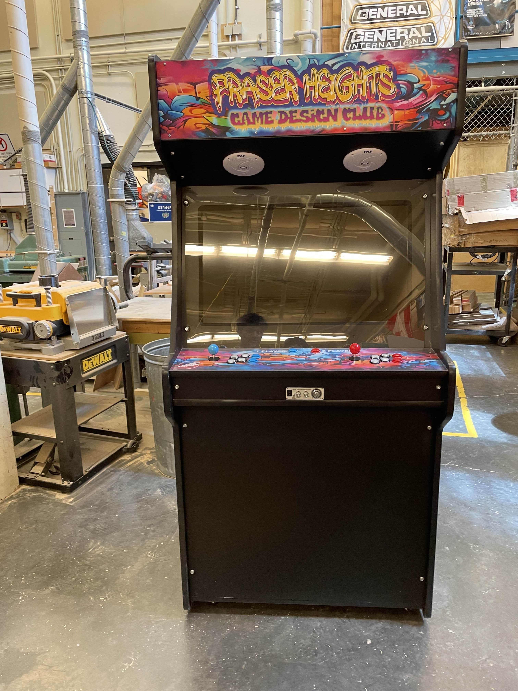
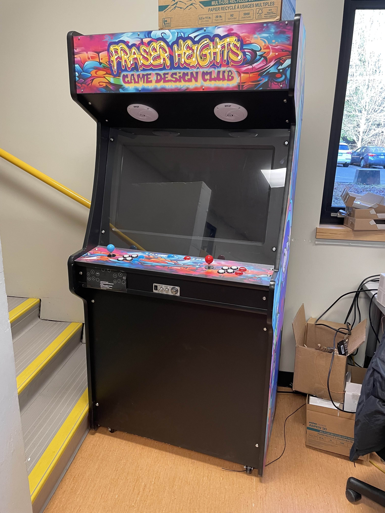
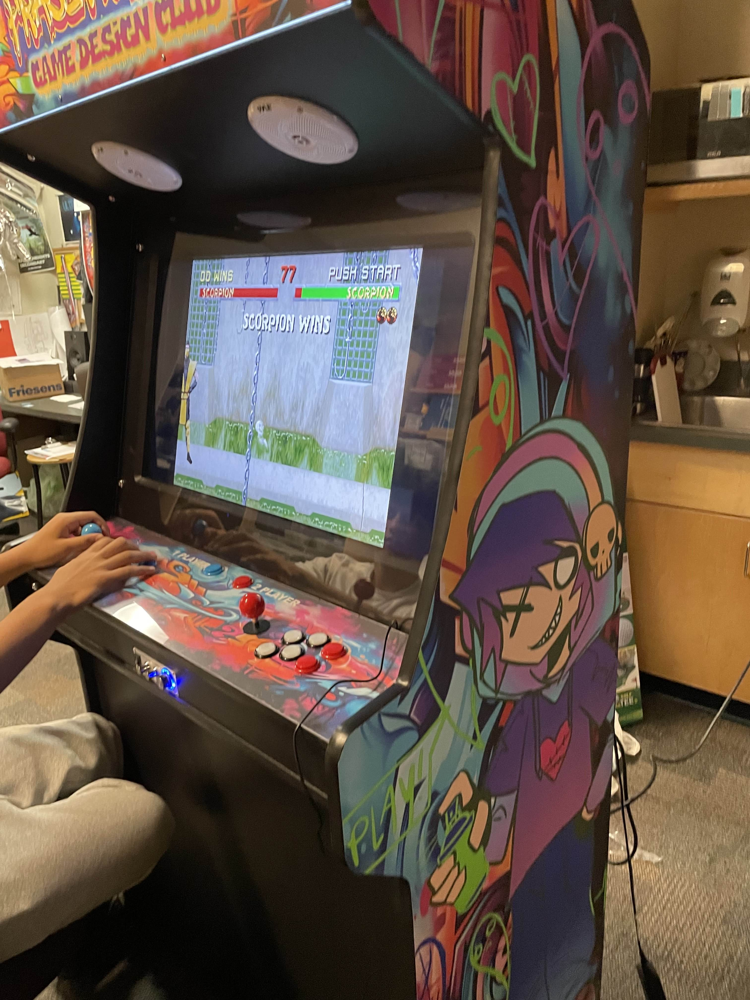

# 🎮 School Arcade Platform
A Raspberry Pi-based arcade system built for students, designed for easy access and fun gaming experiences.  
Configured with **SSH**, **EmulationStation**, and optimized file management.

---

## 📸 Screenshots

---

## 🔧 Features
- Raspberry Pi-based arcade system
- SSH-enabled for secure remote file management
- EmulationStation for intuitive game navigation
- Organized ROM folders for multiple consoles

---

## 🛠 Technologies Used
- Raspberry Pi Lite OS
- EmulationStation
- Bash scripting
- SSH for remote access

---

## 👨‍💻 My Role
- Enabled SSH for secure file transfers
- Transferred and organized ROM files
- Configured EmulationStation for a seamless user experience
- Worked with teachers to create the arcade for students at Fraser Heights Secondary School

---
